# Building a Crowd Funded BlockChain Lottery Application

Among the various applications of BlockChain, optimizing lottery is one of the urgent needs to ensure their fairness and transparency. The emerging blockchain technology shows a glimpse of solutions to fairness and transparency issues faced by lottery industries. Here we present the design of a blockchain-based lottery system. We adopt the smart contracts of blockchain technology and the cryptograph blockchain model. Fairness, transparency, and privacy of the proposed blockchain-based lottery system is shown.

## Application Workflow Diagram
  

## Featured technologies

  *###Node JS (https://nodejs.org/en/) 
  Node.js is an open-source, cross-platform JavaScript run-time environment that executes JavaScript code outside of a browser. 
  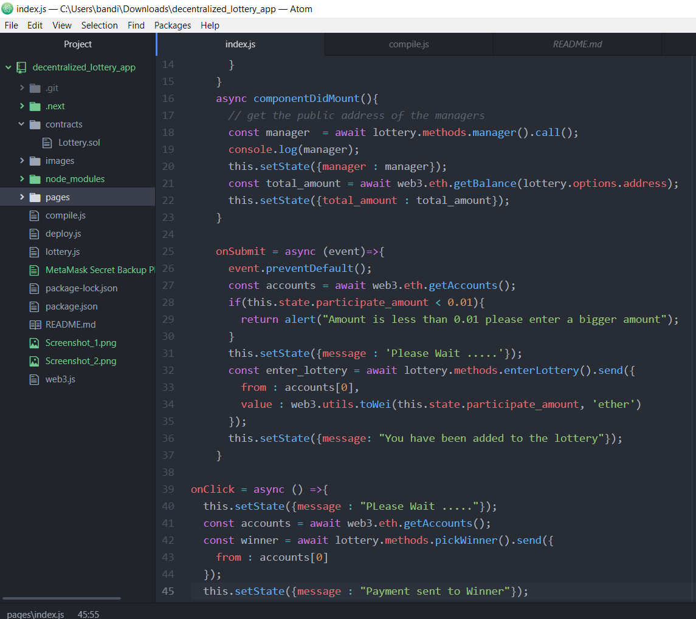
   
*###Remix IDE (https://remix.ethereum.org/) 
  Remix is a powerful, open source tool that helps you write Solidity contracts straight from the browser. 
  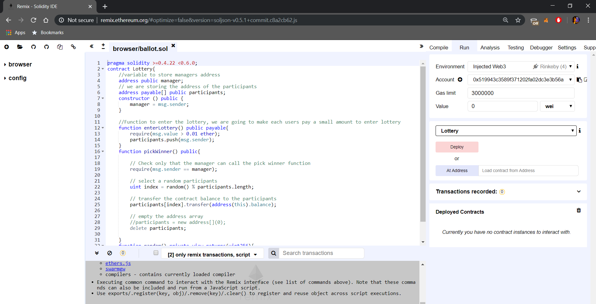
   
*###Metamask (https://metamask.io/) 
  MetaMask is a bridge that allows you to visit the distributed web of tomorrow in your browser today. It allows you to run Ethereum dApps right in your browser without running a full Ethereum node. 
  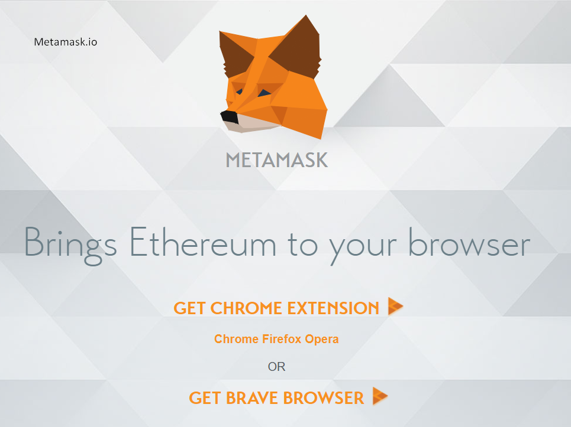
   
*###Rinkeby TestNet (https://www.rinkeby.io/#explorer) 
  A sandbox for safely testing and demonstrating where no real value is exchanged. Etherscan allows you to explore and search the Rinkeby blockchain for transactions, addresses, tokens, prices and other activities taking place on Rinkeby. 
  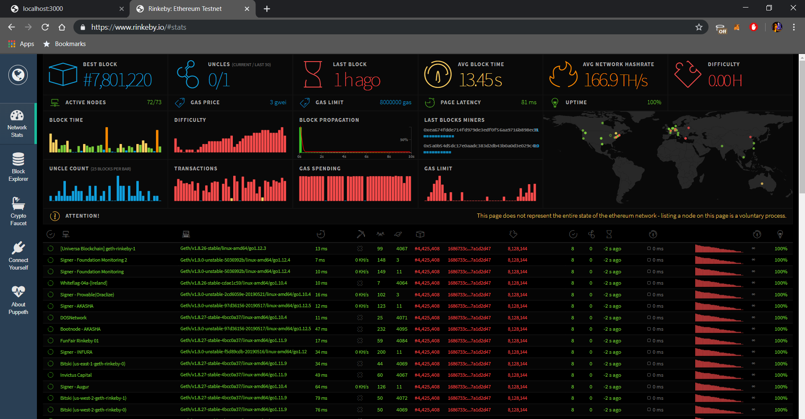
   
*###Infura (https://infura.io/) 
  Secure, reliable, and scalable access to Ethereum APIs and IPFS gateways. 
  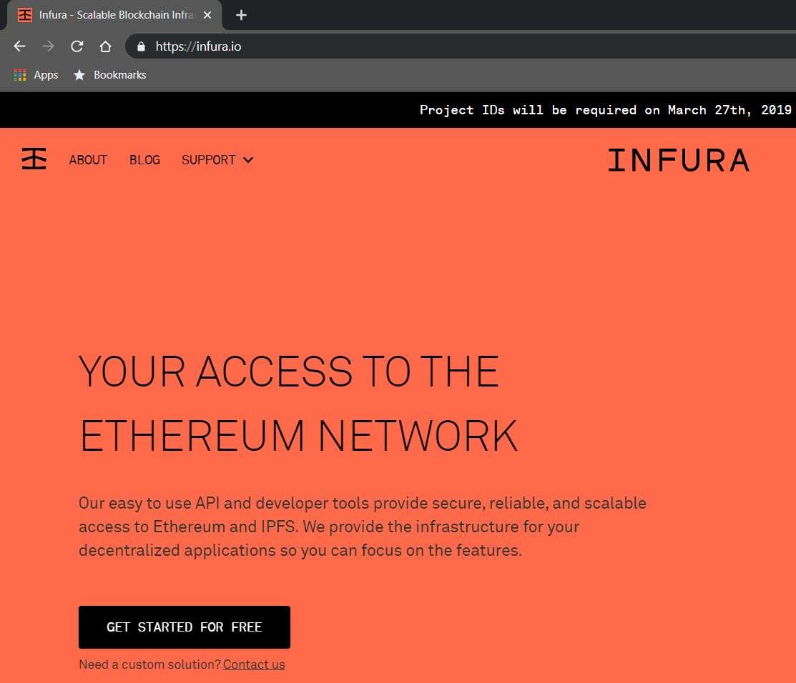
   

## Steps

  *###NPM run 
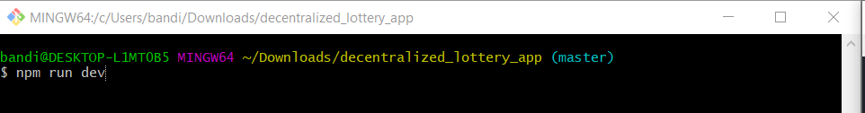
 *###Localhost:3000 
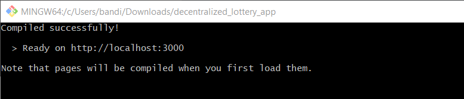
 *###Web Browser default page (note: lottery pool 0) 
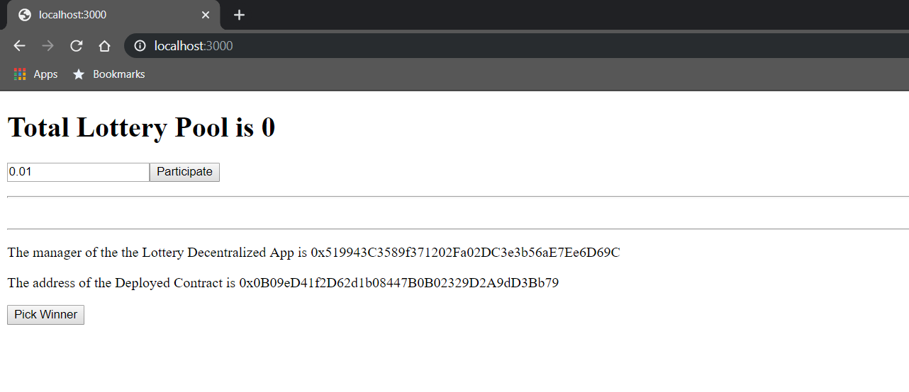
 *###Rinkeby browser Addon and test Accounts 
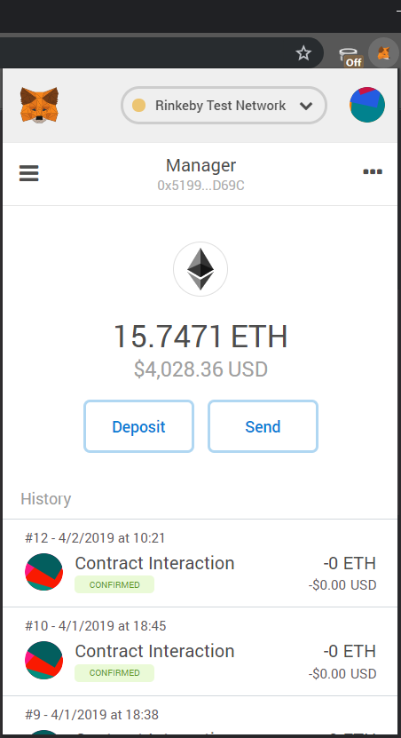
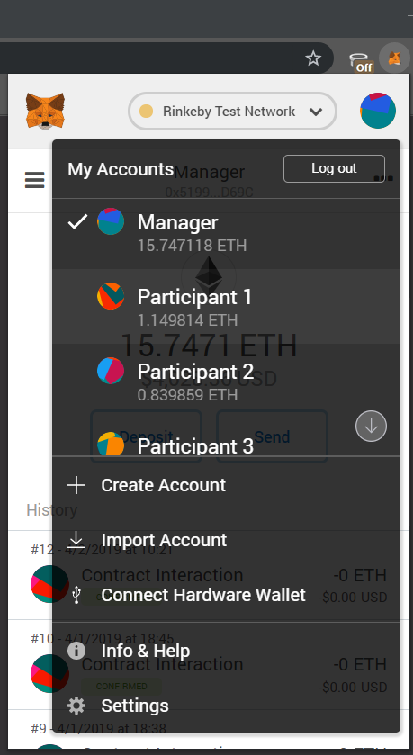
 *###Entering currency amount and participating in the lottery 
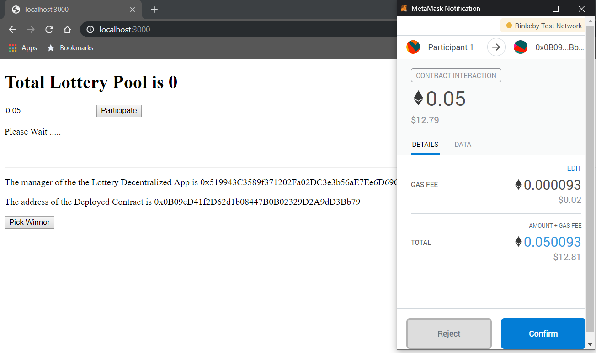
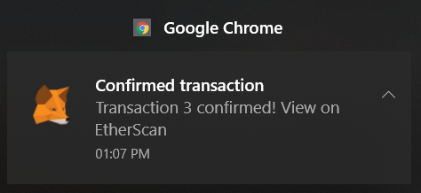
 *###Using Rinkeby Etherscan to see the contract details and transactions 
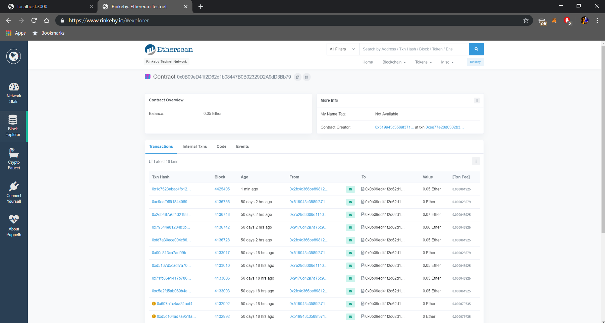
 *###Adding more participants and increase in Pool Amount  
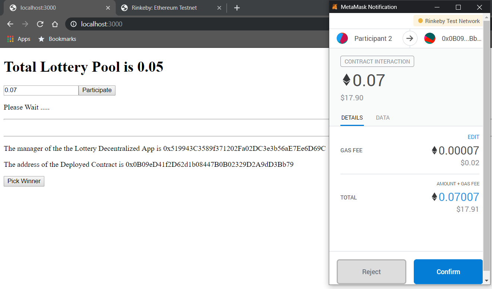
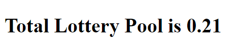
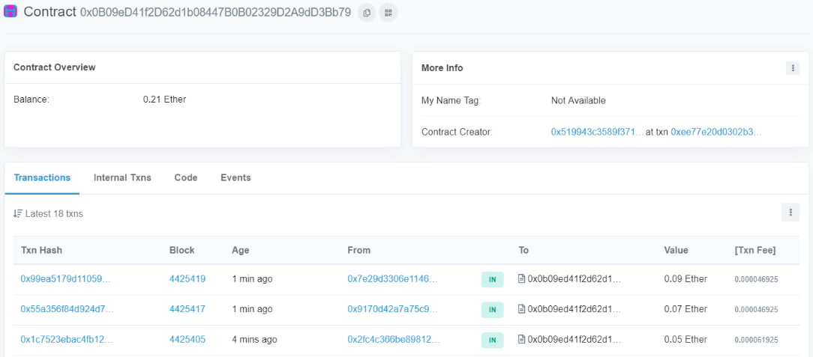
 *###Picking a winner, using the managers account. (note: works only when the managers address matches in the contract) 
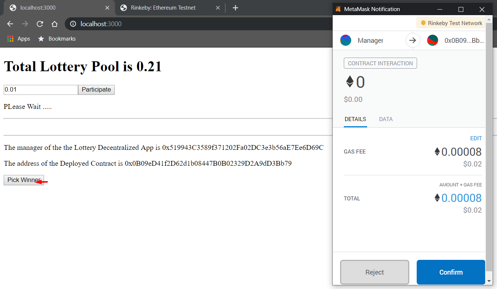
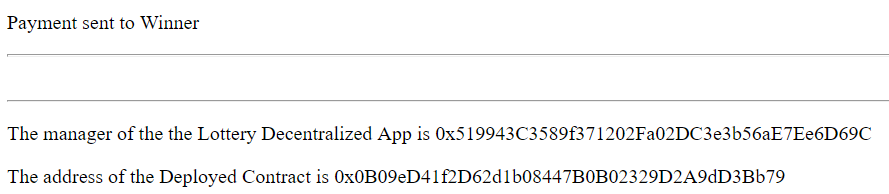
 *###Viewing the winner 
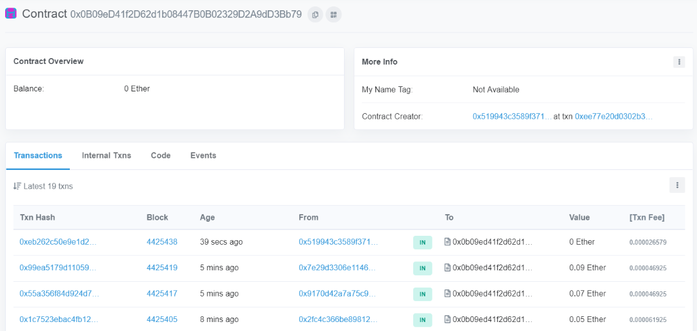
